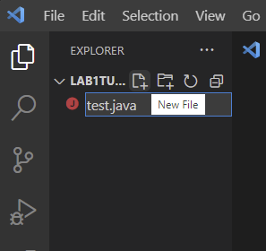
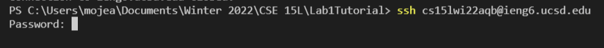
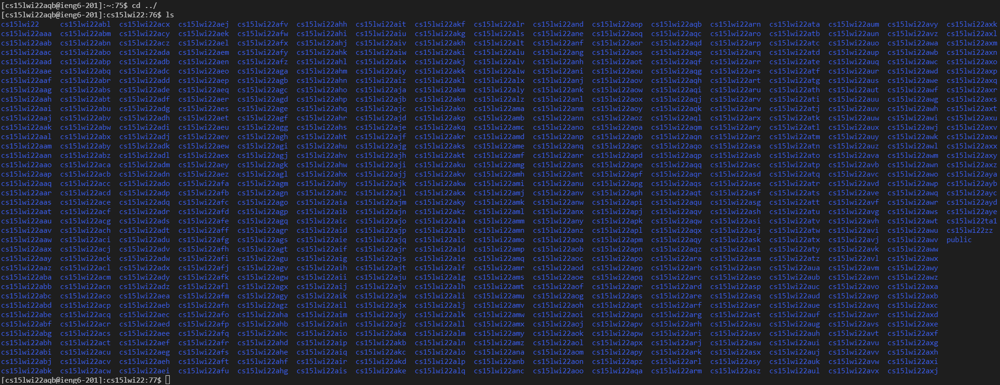
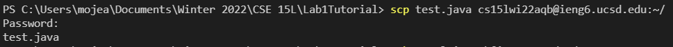
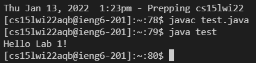
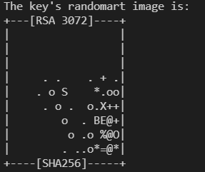
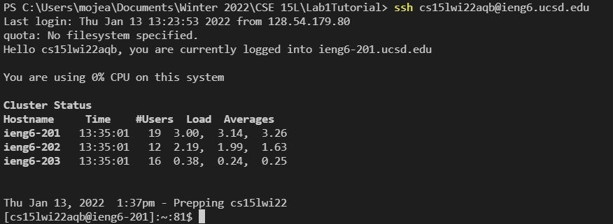
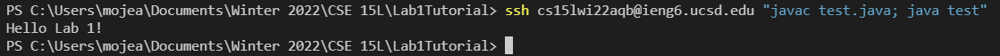

# CSE 15L Lab Report 1 (Week 2): Running code remotely!
## Step 1: Setting up VScode
* The first thing you'll want to do is install VScode for your system at the link [here](https://code.visualstudio.com/download)!
* Next, create a folder in your file explorer to hold your project files and open it in VScode by going to *File>Open Folder* on the top left corner of the screen and selecting the folder.
* Then, next to the folder name in explorer, click on the new file button and create a java file. I named mine `test.java`
<br />
## Step 2: Remotely Connecting
* You'll need to acquire your ieng6 account username at the link [here](https://sdacs.ucsd.edu/~icc/index.php). It should be in the format `cs15lwi22zzz` with 3 letters at the end. You may need to create or change your password if you haven't already this quarter.
* Now that you have your username and password, open a terminal in your project by going up to *Terminal>New Terminal* at the top of the screen.
* Here, to connect to the remote computers, type `ssh cs15lwi22zzz@ieng6.ucsd.edu` with your username. You'll be prompted to enter your password, and then you're in!
<br />
 Note: You may notice that the password field stays blank even when you're typing. That is done to protect your password from pesky onlookers!
 
## Step 3: Trying commands
* Now that you're in, there's a couple commands you can try:
1. `pwd`: Prints the current working directory that you are in!
2. `ls -a`: Prints all files in the directory that you are in!
3. `cd ../`: Change directory combined with `../` sends you back a directory! by typing `ls`, you can see everyone elses' accounts in CSE 15L! To return to your home, type `cd ~`
<br />
## Step 4: Moving Files with SCP
* To logout from the remote terminal, type `exit`.
* Let's edit our java file. Try typing in a simple print command. In the class body, add:
```
    public static void main(String[] args){
    System.out.println("Hello Lab 1!");
    }
```
* To compile it locally, type `javac test.java` followed by `java test`. This should return `Hello Lab 1!`
* To send it to our remote computer, we use scp:
```
scp test.java cs15lwi22zzz@ieng6.ucsd.edu:~/
```
* Don't forget to add the `:~/` at the end of the address to send it to your home directory!
* Just like ssh, you will be asked to enter your password.
* To check if it sent, log back in using ssh and try running and compiling from there!
<br />
<br />
## Step 5: Setting up an SSH Key
* You may have noticed that we had to type in our password twice just to upload and run our code!
* To make this process more efficient, lets create some RSA keys!
* Back on the client terminal, type `ssh-keygen` to create a key pair.
* Make sure to only hit enter until you get the message that contains the cool randomart image, as well as the locations of your keys.
<br />
> So cool!
* Take note of where your public key was saved in, we'll need to send this to the remote computer. It should be the path preceded by: `Your public key has been saved in`...
* Send your public key to a new folder `.ssh` and new subfolder `authorized_keys` using scp in one foul swoop:
```
scp [insert path here] cs15lwi22zzz@ieng6.ucsd.edu:~/.ssh/authorized_keys
```
* Now try logging in again using ssh. You won't have to type in your password this time!
<br />
## Step 6: Optimization
* How can we make this process more efficient?
* Try:
```
ssh cs15lwi22zzz@ieng6.ucsd.edu "javac test.java; java test"
```
<br />
> Wow, that was fast!
* This is because:
1. Appending commands to the end of ssh will have them run on the remote computer.
2. Putting a comma between commands will have them run in succession.
3. Wrapping them in quotes ensures that both will run on the remote system!