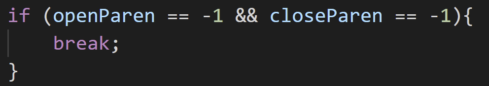
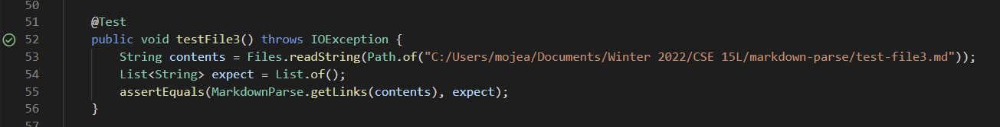

# CSE 15L Week 4 Lab Report 2: Test Accumulation
## Fix 1: Infinite looping due to no parenthesis
* Testing test-file 3, 4, 7, and 8 provided by the professor resulted in an infinite loop that broke our test cases.

* After defining the indexes of the open and closed paranthesis, we can break out of the while loop before any elements are attempted to be added to the array if there is no parenthesis present.

* Now each test correctly prints an empty array.

## Fix 2: