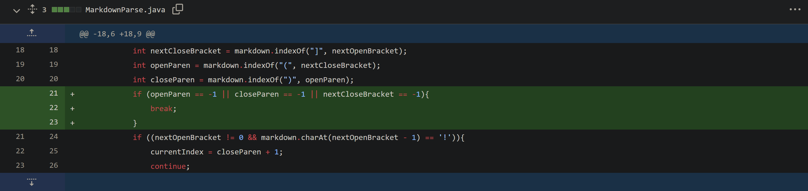

# CSE 15L Week 4 Lab Report 2: Test Accumulation
## Fix 1: Infinite looping
* SYMPTOM: Testing test-file [3](https://github.com/mojeanmac/markdown-parse/blob/main/test-file3.md), [4](https://github.com/mojeanmac/markdown-parse/blob/main/test-file4.md), [7](https://github.com/mojeanmac/markdown-parse/blob/main/test-file7.md), and [8](https://github.com/mojeanmac/markdown-parse/blob/main/test-file8.md) provided by the professor resulted in an infinite loop that broke our test cases. All of these cases do not have a complete set of parenthesis "()".


* THE BUG: The while loop runs infinitely while searching for parenthesis (or a closed bracket) that do not exist, which crashes our test cases.
* FIXING THE BUG: After defining the indexes of the open and closed paranthesis, we can break out of the while loop before any elements are attempted to be added to the array if there are no closed brackets or open/closed paranthesis.
```
    if (openParen == -1 || closeParen == -1 || nextCloseBracket == -1){
        break;
    }
```
* Now each test correctly prints an empty array, except test 8 which correctly prints the one complete item.

* DIFF LOG:

## Fix 2: Images shown as links
* SYMPTOM: Testing [test2.md](https://github.com/mojeanmac/markdown-parse/blob/main/test2.md) resulted in including the link to an image in the printed array, which we don't want.


* THE BUG: The program only checks for open and closed brackets and parenthesis, ignoring everything else. This includes the "!" tag for images.
* FIXING THE BUG: Whenever "!" is found, the link is skipped by changing the current index to after the link and the while loop continues.
```
    if ((nextOpenBracket != 0 && markdown.charAt(nextOpenBracket - 1) == '!')){
            currentIndex = closeParen + 1;
            continue;
        }
```
* Now test2 only prints the two links:

* DIFF LOG:


## Fix 3: Other nonlinks showing as links
* In fix 1, the "link" in [test-file8.md](https://github.com/mojeanmac/markdown-parse/blob/main/test-file8.md) isn't really a link because it has spaces. [test-file5.md](https://github.com/mojeanmac/markdown-parse/blob/main/test-file5.md) also is not a link because there is text between the [] and ().
* SYMPTOM: Additional tests [test3.md](https://github.com/mojeanmac/markdown-parse/blob/main/test-file3.md) and [test4.md](https://github.com/mojeanmac/markdown-parse/blob/main/test4.md) focus on these issues and print the incorrect links instead of empty arrays, which fail the testers.


* THE BUG: The program skips over any text between the [] and (), as well as ignoring any spaces within the ().
* FIXING THE BUG: By making sure the index directly after the closed bracket is an open paranthesis, as well as verifying that there are no spaces in the substring between the parenthesis, we can fix both of these issues at once by adding them to the same if statement as the image skipper in the previous step.
```
    if ((nextOpenBracket != 0 && markdown.charAt(nextOpenBracket - 1) == '!') ||
    nextCloseBracket + 1 != openParen ||
    markdown.substring(openParen + 1, closeParen).indexOf(" ") != -1){
        currentIndex = closeParen + 1;
        continue;
    }
```
* Now all files mentioned above print the correct results as they all do not contain any properly formatted urls.

* DIFF LOG:
