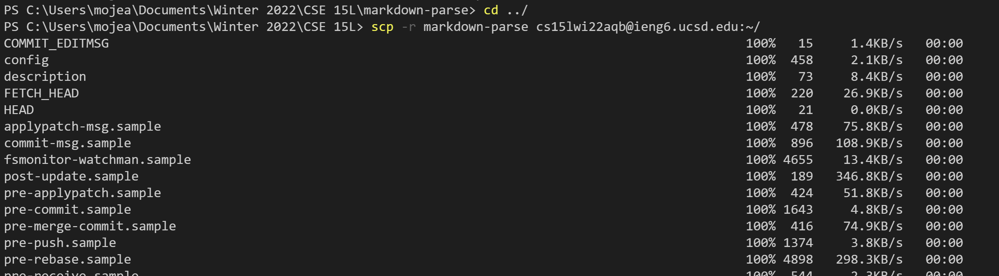
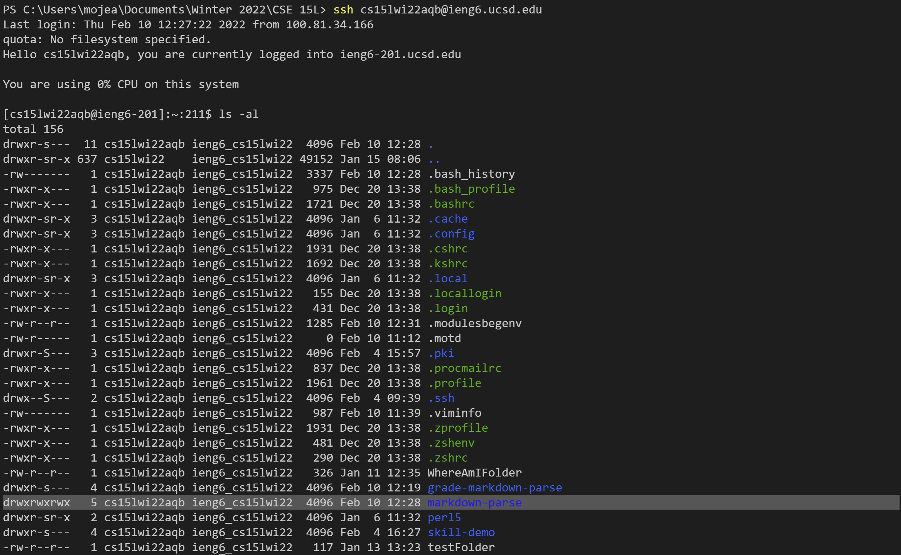
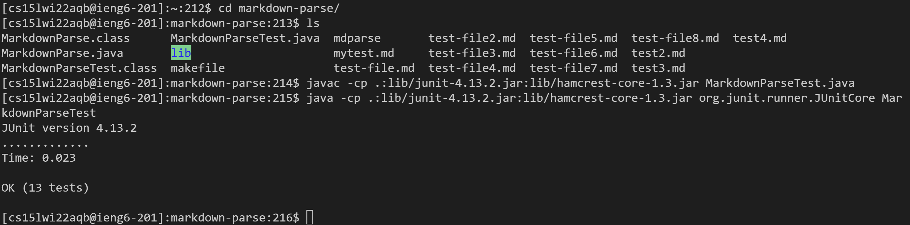
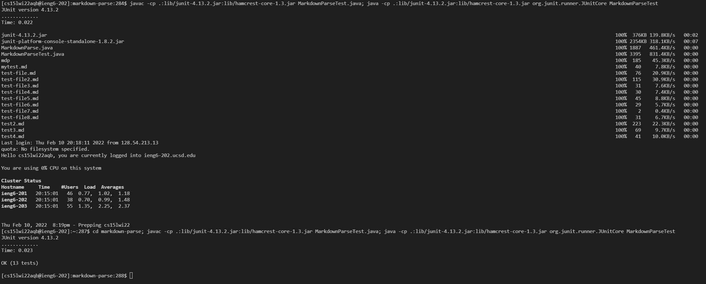

# CSE 15L Lab 3 Week 6: Copy whole directories with `scp -r`

## Show copying your whole markdown-parse directory to your ieng6 account:

* I went back a folder using `cd../` and recursively sent the entire repo folder to my home ieng6 directory.
* This resulted in a long list of files (including hidden ones) to be sent one-by-one and appear on the command line.

## Show logging into your ieng6 account after doing this and compiling and running the tests for your repository:

* After sshing back to my ieng6 account, I can see that the markdown-parse folder has been created (I previously removed the github cloned version).

* I change directories into repo and it runs correctly!

## Show (like in the last step of the first lab) combining `scp`, `;`, and `ssh` to copy the whole directory and run the tests in one line.

* Because of the different java versions, it became more difficult to manage the specific files to send and run on the same line.
* Time management-wise, it becomes more efficient to send and connect via ssh on one line, and then navigate, run, and compile on another line after connecting.