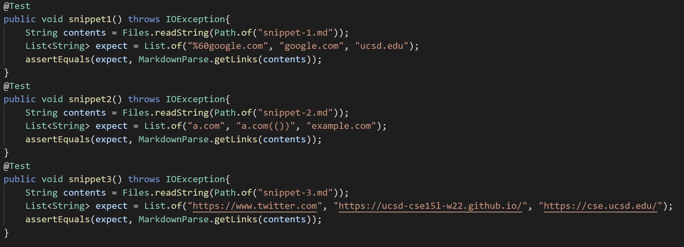
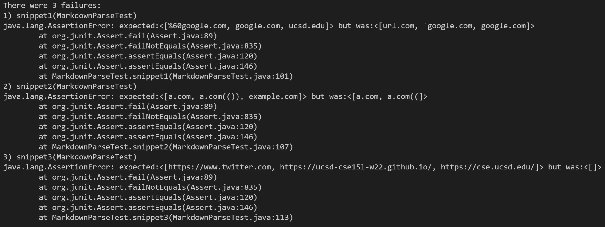
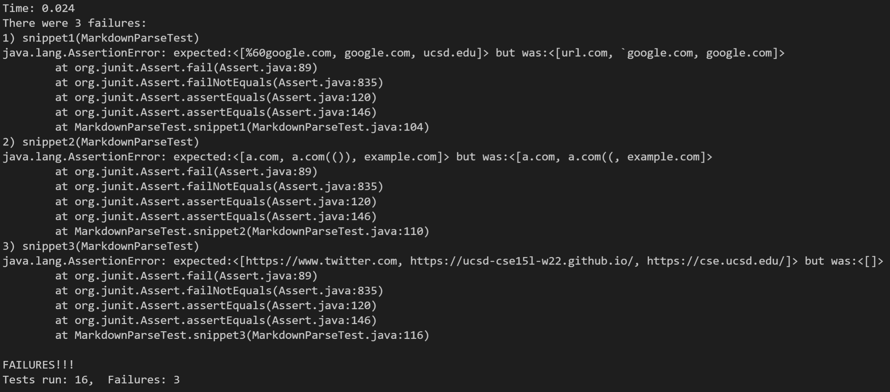

# Week 8 Lab Report

## Snippet tests
Based on the display in the VScode preview, these are the tests for the output I expected:

## My MarkdownParse (From week 6 and before)
[My repository link](https://github.com/mojeanmac/markdown-parse)

Looks like I failed all 3 snippet tests!

## Group MarkdownParse (From week 7)
[Their repository link](https://github.com/ocboogie/markdown-parse/)

And they failed all three snippet tests!

## Snippet 1 Fixes
Our problem here is that neither MarkdownParses account for backticks whatsoever. We would need to create an if statement or method that accounts for these by ignoring links with backticks that cross over corresponding pairs of brackets, as well as the irregularities in links that contain backticks. For example, "`google.com" becomes "%60google.com".

## Snippet 2 Fixes
Neither example is able to render `a.com(())` properly, although the group repo is still able to add `example.com`. To fix this, we would have to make sure that the parentheses correspond to eachother, rather than finding the next immediate closed paranthesis. I believe using a stack datastructure to store these would be helpful given the "first in first out" nature of traversing parenthesis pairs. This may take more than 10 lines of code.

## Snippet 3 Fixes
Both programs do a line-by-line scan of the files, so we haven't accounted for links spanning multiple lines. The programs see the links as unfinished and ignores them! A fix for this would entail continuing the search on the next line and reworking how MarkdownParse reads files altogether.