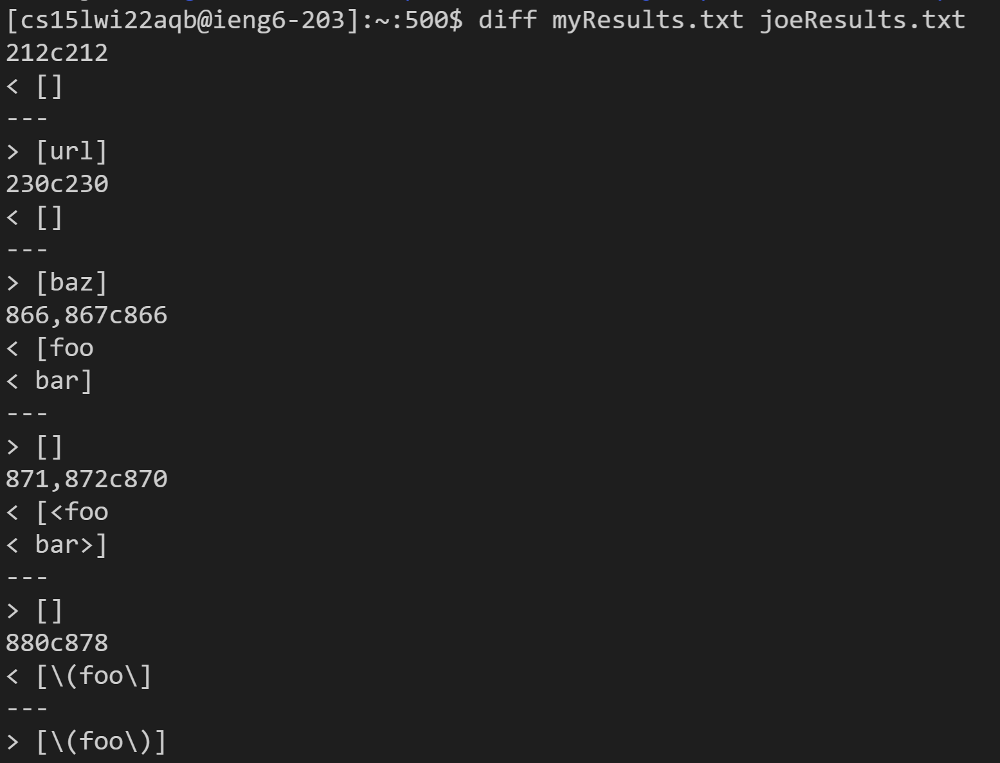
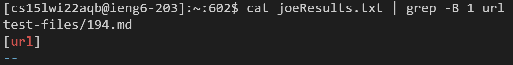
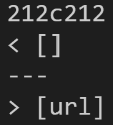
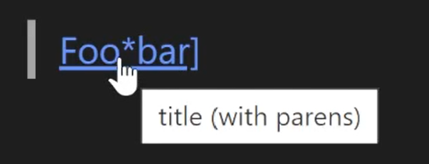
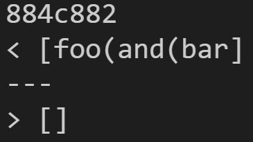
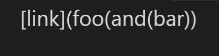

# Lab Report 5, Week 10

## How I found the tests:



- I was able to find the difference between the outputs by using `diff` to compare the text files containing the outputs of both markdown-parse repositories.
- Then, I used `grep` to find the test for the matching output, including the line before that prints the test name.



## Test 1: 194.md
```
[Foo*bar\]]:my_(url) 'title (with parens)'

[Foo*bar\]]
```
- View the file [here](194.md)



### Which implementation is correct?
- It appears that neither is correct according to VScode's implementation:



### Describe the bug:
- According to this section on [markdownguide.org](https://www.markdownguide.org/basic-syntax/#formatting-the-first-part-of-the-link), a link title can be created by wrapping it in singe quotes (`'`) if the brackets are followed by a colon (`:`)
- This means that the actual link should be `my_(url)`
- To fix this, we would need to account for these types of links by checking for a colon after the brackets and finding the link before the bounds of the link title.
- Additionally, the way that Github Pages displays this file as an [html page](194.html) is with **no links**, indicating that my implementation (the first one) is correct! It really depends what platform you deem "correct" to decide how to move forward.

## Test 2: 496.md
```
[link](foo(and(bar))
```

- View the file [here](496.md)



### Which implementation is correct?

- Joe's implementation is correct because no links are found by VScode:



### Describe the bug:
- My code does not account for an uneven number of parenthesis. In this test, there are 3 open and 2 closed parenthesis, which markdown does not like!
- To fix this, I would either change the way I look for parenthesis so that it matches the way our instructor implemented, or create two counters for open and closed parenthesis to check if there is an uneven amount. If there is, then do not include the link.